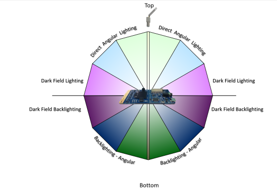

# Vision on the Edge
<!-- markdownlint-disable MD024 -->

## Introduction

Visual inspection of products, resources and environments has been a core practice for most Enterprises, and was, until recently, a very manual process. An individual, or group of individuals, was responsible for performing a manual inspection of the asset or environment, which, depending on the circumstances, could become inefficient, inaccurate or both, due to human error and limitations.

In an effort to improve the efficacy of visual inspection, Enterprises began turning to deep learning artificial neural networks known as convolutional neural networks, or CNNs, to emulate human vision for analysis of images and video.  Today this is commonly called computer vision, or simply Vision AI. Artificial Intelligence for image analytics spans a wide variety of industries, including manufacturing, retail, healthcare and the public sector, and an equally wide area of use cases.

**Vision as Quality Assurance** – In manufacturing environments, quality inspection of parts and processes with a high degree of accuracy and velocity is one of the use cases for Vision AI. An enterprise pursuing this path automates the inspection of a product for defects to answer questions such as:

* Is the manufacturing process producing consistent results?
* Is the product assembled properly?
* Can I get notification of a defect sooner to reduce waste?
* How can I leverage drift in my computer vision model to prescribe predictive maintenance?

**Vision as Safety** – In any environment, safety is a fundamental concern for every Enterprise on the planet, and the reduction of risk is a driving force for adopting Vision AI. Automated monitoring of video feeds to scan for potential safety issues affords critical time to respond to incidents, and opportunities to reduce exposure to risk.  Enterprises looking at Vision AI for this use case are commonly trying to answer questions such as:

* How compliant is my workforce with using personal protective equipment?
* How often are people entering unauthorized work zones?
* Are products being stored in a safe manner?
* Are there non-reported close calls in a facility, i.e. pedestrian/equipment “near misses?”

## Why vision on the Edge

Over the past decade, computer vision has become a rapidly evolving area of focus for Enterprises, as cloud-native technologies, such as containerization, have enabled portability and migration of this the technology toward the network edge. For instance, custom vision inference models trained in the Cloud can be easily containerized for use in an Azure IoT Edge runtime-enabled device.

The rationale behind migrating workloads from the cloud to the edge for Vision AI generally falls into two categories – performance and cost.

On the performance side of the equation, exfiltrating large quantities of data can cause an unintended performance strain on existing network infrastructure. Additionally, the latency of sending images and/or video streams to the Cloud to retrieve results may not meet the needs of the use case. For instance, a person straying into an unauthorized area may require immediate intervention, and that scenario can ill afford latency when every second counts. Positioning the inferencing model near the point of ingest allows for near-real time scoring of the image, and alerting can be performed either locally or through the cloud, depending on network topology.

In terms of cost, sending all of the data to the Cloud for analysis could significantly impact the ROI of a Vision AI initiative.  With Azure IoT Edge, a Vision AI module could be designed to only capture the relevant images that have a reasonable confidence level based on the scoring, which significantly limits the amount of data being sent.

The purpose of this document is to give some concrete guidance on some of the key decisions when designing an end-to-end vision on the edge solution.  Specifically, we will address:

* [Camera selection and placement](#camera-considerations)
* [Hardware acceleration](#hardware-acceleration)
* [Choice of ML model](#machine-learning-model)
* [Image storage and management](#image-storage-and-management)
* [Persistence of alerts](#inferencing-results-persistence)
* [User Interface](#user-interface)

## Camera Considerations

### Camera selection

One of the most critical components to any vision workload is selecting the correct camera.  The items that are being identified in a vision workload must be presented in such a way so that a computer’s artificial intelligence or machine learning models can evaluate them correctly.  To further understand this concept, you need to understand the different camera types that can be used.  One thing to note in this article as we move forward, there are a lot of different manufacturers of Area, Line, Smart Cameras.   Microsoft does not recommend any one vendor over another - instead we recommend that you select a vendor that fits your specific needs.

#### Area Scan Cameras

This is more your traditional camera image, where a 2D image is captured and then sent over to the Edge hardware to be evaluated.  This camera typically has a matrix of pixel sensors.

**When should you use an Area Scan Camera?**  As the name suggest, Area Scan Cameras look at a large area and are great at detecting change in an area. Some examples of workloads that would use an Area Scan Camera would be workplace safety, or detecting or counting objects (people,animals,cars,etc.) in an environment.

Examples of manufacturers of Area Scan Cameras are [Basler](https://www.baslerweb.com/en/products/industrial-cameras/), [Axis](https://www.axis.com/en-us), [Sony](https://www.sony.co.jp/Products/ISP/products/), [Bosch](https://commerce.boschsecurity.com/us/en/IP-Cameras/c/10164917899), [FLIR](https://www.flir.com/), [Allied Vision](https://www.alliedvision.com/en/digital-industrial-camera-solutions.html)

#### Line Scan Cameras

Unlike the Area Scan Cameras, the Line Scan Camera has a single row of linear pixel sensors.  This can allow the camera to take one-pixel width in very quick successions and then stitches these one-pixel images into a video stream that is sent over to an Edge Device for processing

**When should you use a Line Scan Camera?** Line Scan Cameras are great for vision workloads where in the items to be identified are moving past the camera, or items that need to be rotated to detect defects.  The Line Scan Camera would then be able to produce a continuous image stream that can then be evaluated.  Some examples of workloads that would work best with a Line Scan Camera would be item defect detection on parts that are moved on a conveyer belt; workload that require spinning to see a cylindrical object; any workload that requires rotation.

Examples of manufacturers of Area Scan Cameras are [Basler](https://www.baslerweb.com/en/products/industrial-cameras/), [Teledyne Dalsa](https://www.teledynedalsa.com/en/home/), [Hamamatsu Corporation](https://www.hamamatsu.com/us/en/index.html?nfxsid=5ede4ac8e12e41591626440), [DataLogic](https://www.datalogic.com/), [Vieworks](https://vieworks.com/), and [Xenics](https://www.xenics.com/)

#### Embedded Smart Camera

This type of camera can use either a Area Scan or Line Scan Camera for the acquisition of the images, however, the Line Scan Smart Camera is rare.  The main feature of this camera is that it not only acquires the image, but it can also process the image as they are a self-contained stand-alone system.  They typically have either and RS232 or Ethernet port output, and this allows the Smart Cameras to be integrated directly into a PLC or other IIoT interfaces.

Examples of manufacturers of Embedded Smart Cameras are  [Basler](https://www.baslerweb.com/en/products/industrial-cameras/), [Lesuze Electronics](https://www.leuze.com/en/usa/)

#### Other camera features to consider

* **Sensor size:**  This is one of the most important factors to evaluate in any vision workload.  A sensor is the hardware within a camera that is capturing the light and converting into signals which then produces an image.  The sensor contains millions of semiconducting photodetectors that are called photosites.  One thing that is a bit of a misconception is that higher megapixel count is a better image.  For example, let’s look at two different sensor sizes for a 12-megapixel camera.  Camera A has a ½ inch sensor with 12 million photosites and camera B has a 1-inch sensor with 12 million photosites.  In the same lighting conditions the camera that has a 1-inch sensor will be cleaner and sharper.  In cameras that would be used in vision workloads would have a sensor between ¼ inch to 1 inch.  In some cases, much larger sensors might be required.  **_If a camera has a choice between a larger sensor or a smaller sensor some factors consider as to why you might choose the larger sensor are:_**
  * need for precision measurements
  * Lower light conditions
  * Shorter exposure times, i.e. fast-moving items
* **Resolution:** This is another one of the most important factors to both Line Scan and Area Scan camera workloads.  If your workload must identify fine features (Ex. writing on an IC Chip) then you need greater resolutions of the cameras used.  If your workload is trying to detect a face, then higher resolution is required.  And if you need to identify a vehicle from a distance, again this would require higher resolution.
* **Speed:** Sensors come in two types a CCD and a CMOS.  If the vision workload requires high number of images per second capture rate, then there are two factors that come into play.  The first is how fast is the connection on the interface of the camera and the second is what type of sensor is it.  CMOS sensors have a direct readout from the photosites and because of this they typically offer a higher frame rate.

> NOTE:  There are more camera features to consider when selecting the correct camera for your vision workload.  These include lens selection, focal length, monochrome, color depth, stereo depth, triggers, physical size, and support. Sensor manufacturers can help you understand the specific feature that your application may require.

### Camera Placement (location, angle, lighting, etc.)

Depending on the items that you are capturing in your vision workload will determine the location and angles that the camera should be placed.  The camera location can also affect the sensor type, lens type, and camera body type.  There are several key concepts to keep in mind when figuring out the perfect spot to place the camera in.

There are several different factors that can weigh into the overall decision for camera placement.  Two of the most critical are lighting and field of view

#### Camera Lighting

In a computer vision workload lighting is a critical component to camera placement.  There are several different lighting conditions.  While some of the lighting conditions would be useful for one vision workload, it might produce an undesirable condition in another.  Types of lighting that are commonly used in computer vision workloads are:

* **Direct lighting:** this is the most common used lighting condition.  This light source is projected at the object to be captured for evaluation.

* **Line lighting:** This is a single array of lights that are most used with line scan camera applications to create a single line of light where the camera is focused.

* **Diffused lighting:** This type of lighting is used to illuminate an object but prevent harsh shadows and is mostly used around specular objects.

* **Back lighting:** This type of light source is used behind the object, in which produces a silhouette of the object.  This is most useful when taking measurements, edge detection, or object orientation.

* **Axial diffused lighting:** This type of light source is often used with highly reflective objects, or to prevent shadows on the part that will be captured for evaluation.

* **Custom Grid lighting:** This is a structured lighting condition that lays out a grid of light on the object, the intent is to have a known grid projection to then provide more accurate measurements of components, parts, placement of items, etc.

* **Strobe lighting:** Strobe lighting is used for high speed moving parts.  The strobe must be in sync with the camera to take a “freeze” of the object for evaluation, this lighting helps to prevent motion blurring effect.

* **Dark Field lighting:** This type of light source uses several lights in conjunction with different angles to the part.  For example, if the part is laying flat on a conveyor belt the lights would be placed at a 45-degree angle to the part.  This type of lighting is most useful when looking at highly reflective clear objects…and is most commonly used with lens scratch detections.

  Angular placement of light

#### Field of View

In a vision workload you need to know the distance to the object that you are trying to evaluate.  This also will play a part in the camera selection, sensor selection, and lens configuration.  Some of the components that make up the field of view are:

* **Distance to object(s):** For an example is the object that we are monitoring with computer vision on a conveyor belt and the camera is 2 feet above it or is the object across a parking lot.  As the distance changes so does the camera’s sensors and lens configurations.
* **Area of coverage:** is the area that the computer vision trying to monitor small or large.  This has direct correlation to the camera’s resolution overall, lens, and sensor type.
* **Direction of the Sun:** if the computer vision workload is outside, like monitoring a job construction site for worker safety will the camera be pointed in the sun at any time.  Keep in mind that if the sun is casting a shadow over the object that the vision workload is monitoring, items might be obscured a bit.  Also, if the camera is getting direct sunlight in the lens, the camera might be “blinded” until the angle of the sun changes.
* **Camera angle to the object(s):** angle of the camera to the object that the vision workload is monitoring is also critical component to think about.  If the camera is to high it might miss the details that the vision workload is trying to monitor for, and same is true if it is too low.

### Communication Interface

In building a computer vision workload it is also important to understand how the system will interact with the output of the camera.  Below are a few of the standard ways that a camera will communicate to IoT Edge:

* **Real Time Streaming Protocol(RTSP):** RTSP is a protocol that transfers real-time video data from a device (in our case the camera) to an endpoint device (Edge compute) directly over a TCP/IP connection.  It functions in a client server application model that is at the application level in the network.

* **Open Network Video Interface Forum (ONVIF):** a global and open industry forum that is developing open standards for IP-based cameras.  This standard is aimed at standardization of communication between the IP Camera and down stream systems, Interoperability, and Open sourced.

* **USB:** Unlike RTSP and ONVIF USB connected cameras connect over the Universal Serial Bus directly on the Edge compute device.  This is less complex; however, it is limited on distance that the camera can be placed away from the Edge compute.

* **Camera Serial Interface:**  CSI specification is from Mobile Industry Processor Interface(MIPI).  It is an interface that describes how to communicate between a camera and a host processor.

There are several standards defined for CSI

* **CSI-1**:  This was the original standard that MIPI started with.  
* **CSI-2**:  This standard was released in 2005, and uses either D-PHY or C-PHY as physical layers options.  This is further divided into several layers:
  1. Physical Layer (C-PHY, D-PHY)
  2. Lane Merger layer
  3. Low Level Protocol Layer
  4. Pixel to Byte Conversion Layer
  5. Application layer

The specification was updated in 2017 to v2 and added support for RAW-24 color depth, Unified Serial Link, and Smart Region of Interest.

## Hardware Acceleration

Along with the camera selection, one of the other critical decisions in Vision on the Edge projects is hardware acceleration. Options include:

* **CPU:** The Central Processing Unit (CPU) is your default compute for most processes running on a computer, it is designed for general purpose compute. Some Vision Workloads where timing is not as critical this might be a good option. However, most workloads that involve critical timing, multiple camera streams, and/or high frame rates will require more specific hardware acceleration
* **GPU:** Many people are familiar with the Graphics Processing Unit (GPU) as this is the de-facto processor for any high-end PC graphics card. In recent years the GPU has been leveraged in high performance computer (HPC) scenarios, and in data mining, and in computer AI/ML workloads. The GPU’s massive potential of parallel computing can be used in a vision workload to accelerate the processing of pixel data. The downside to a GPU is the power to watt ratio and this is a critical factor to consider for your vision workload.
* **FPGA:** Field Programmable Gate Arrays are reconfigurable hardware accelerators. These powerful accelerators allow for the growth of Deep Learning Neural networks, which are still evolving. These accelerators have millions of programmable gates, hundred of I/O pins, and exceptional compute power (in the Trillions of tera-MAC’s) There also a lot of different libraries available for FPGA’s to use that are optimized for vision workloads. Some of these libraries also include preconfigured interfaces to connect to downstream cameras and devices. One area that FPGA’s tend to fall short on is floating point operations, however, manufacturers are currently working on this issue and have made a lot of improvements in this area.
* **ASIC:** Application Specific Integrated Circuit is by far the fastest accelerator on the market today.  While they are the fastest, they are the hardest to change as they are manufactured to function for a specific task.  These custom chips are gaining popularity due to size, power per watt performance, and IP protection (because the IP is burned into the ASIC accelerator it is much harder to backwards engineer proprietary algorithms).

## Machine learning and data science

The process of designing the machine learning (ML) approach for a vision on the edge scenario one of the biggest challenges in the entire planning process.  Therefore, it is important to understand how to consider and think about ML in the context of edge devices.  Some of the considerations and hurdles are outlined below to help begin to think in terms of using machine learning to address business problems and pain points with guidance including:

- Always consider first how to solve the problem without ML or with a simple ML algorithm
- Have a plan to test several ML architectures as they will have different capacities to "learn"
- Have a system in place to collect new data from the device to retrain an ML model
- For a poorly performing ML models, often a simple fix is to add more representative data to the training process and ensure it has variability with all classes represented equally
- Remember, this is often an iterative process with both the choice of data and choice of architecture being updated in the exploratory phase
- More guidance below

It is not an easy space and, for some, a very new way of thinking.  It is a data driven process. Careful planning will be critical to successful results especially on very constrained devices.

In ML it is always critical to clearly define the problem trying to be solved because the data science and machine learning approach will depend upon this and decisions will be easier the more specific it is.  It is also very  important to consider what type of data will be encountered in the edge scenario as this will determine the kind of ML algorithm that should be used.  

Even at the start, before training any models, real world data collection and examination will help this process greatly and new ideas could even arise.  Below, we will discuss data considerations in detail.  Of course, the equipment itself will help determine the ML approach with regard to device attributes like limited memory, compute, and/or power consumption limits.

Fortunately, data science and machine learning are iterative processes, so if the ML model has poor performance, there are many ways to address issues through experimention.  Below, we will discuss consideratinos around ML architecture choices.  Often, there will be some trial and error involved as well.

### Machine learning data

Both the soure(s) and attributes of data will dictate how the intelligent edge system is built.  For vision, it could be images, videos, or even LiDAR, as the streaming signal. Regardless of the signal, when training an ML model and using it to score new data (called _inferencing_) domain knowledge will be required, such as experience in designing and using ML algorithms or neural network architectures and expertise deploying them to the specialized hardware.  Below are a few considerations related to ML, however, it is recommended to gain some deeper knowledge in order to open up more possibilities or find an ML expert with edge experience to help with the project.

Collecting and using a _balanced dataset_ is critical, that is, equally representating all classes or categories.  When the ML model is trained on a dataset, generally that dataset has been split into train, validate and test subsets.  The purpose of these subsets is as follows.
- The training dataset is used for the actual model training over many passes or iterations (often called _epochs_).
- Througout the training process, the model is spot-checked for how well it is doing on the validation dataset.  
- After a model is done training, the final step is to pass the test dataset through it and assess how well it did as a proxy to the real-world.  Note: be wary of optimizing for the test dataset (in addition to the training dataset) once one test has been run.  It might be good to have a few different test datasets available.

Some good news is if using deep learning, often costly and onerous feature engineering, featurizations, and preprocessing can be avoided because of how deep learning works to find signal in noise better than traditional ML.  However, in deep learning, transformations may still be utilized to clean or reformat data for model input during training as well as inference.  Note, the same preprocessing needs to be used in training and when the model is scoring new data.  

When advanced preprocessing is used such as de-noising, adjusting brightness or contrast, or transformations like RGB to HSV, it must be noted that this can dramatically change the model performance for the better or, sometimes, for the worse.  In general, it is part of the data science exploration process and sometimes it is something that must be observed once the device and other components are placed in a real-world location.

After the hardware is installed into its permanent location, the incoming data stream should be monitored for data drift.
- **Data drift**:  deviation due to changes in the current data compared to the original.  Data drift will often result in a degradation in in model performance (like accuracy), albeit, this is not the only cause of decreased performance (e.g. hardware or camera failure).  

There should be an allowance for data drift testing in the system.  This new data should also be collected for another round of training (the more representative data collected for training, the better the model will perform in almost all cases!), therefore, preparing for this kind of collection is always a good idea.

In addition to using data for training and inference, new data coming from the device could be used to monitor the device, camera or other components for hardware degradation.

In summary, here are the key considerations:

- Always use a balanced dataset with all classes represented equally
- The more representative data used to train a model, the better
- Have a system in place to collect new data from device to retrain
- Have a system in place to test for data drift
- Only run a test set through a new ML model once - if you iterate and retest on the same test set this could cause overfitting to the test set in addition to the training set

### Machine learning architecture choices
 
An ML _architecture_ is the layout of the mathematical operations that process input into our desired, actionable output.  For instance, in deep learning this would be the number of layers and neurons in each layer of a deep neural network, plus their arrangement.  It is important to note that there is no guarantee that the  performance metric goal (e.g. high enough accuracy) for one ML architecture will be achieved.  To mitigate this, several different architectures should be considered.  Often, two or three different architectures are tried before a choice is made.  Remember, this is often an iterative process with both the choice of data and choice of architecture being updated in the exploratory phase of the development process.

It helps to understand the issues that can arise when training an ML model that may only be seen after training or, even, at the point of inferencing on device.  Some such issues include overfitting and underfitting as introduced below.

In the training and testing process, one should keep an eye out for overfitting and underfitting:  
- **Overfitting**: can give a false sense of success because the performance metric (like accuracy) might be very good when the input data looks like the training data.  However, overfitting can occur when the model fits to the training data too closely and can not generalize well to new data.  For instance, it may become apparent that the model only performs well indoors because the training data was from an indoor setting.  This can be caused by:
    - The model learned to focus on incorrect, non-representative features specifically found in the training dataset
    - The model architecture may have too many learnable parameters (correlated to the number of layers in a neural network and units per layer) - note, the model's _memorization capacity_ is determined by the number of learnable parameters
    - Not enough complexity or variation in the training data
    - Trained over too many iterations
    - Other reasons for good performance in training and significantly worse performance in validation and testing
- **Underfitting**: the model has generalized so well that it can not tell the difference between classes with confidence - e.g. the training _loss_ will still be unacceptably high.  This can be caused by:
    - Not enough samples in training data
    - Trained for too few iterations - too generalized
    - Other reasons related to the model not being able to recognize any objects or poor recogntion and _loss values_ during training (the assessment values used to direct the training process through a process called _optimization_ and _weight updates_)

There is a trade-off between too much capacity (a large network or one with big number of learnable parameters) and too little capacity.  In _transfer learning_ (where some network layers are set as not trainable, i.e. _frozen_) increasing capacity would equate to "opening up" more, earlier layers in the network versus only using the last few layers in training (with the rest remaining frozen).

There isn't a hardfast rule for determining number of layers for deep neural networks, thus sometimes several model architectures must be evaluated within an ML task.  However, in general, it is good to start with fewer layers and/or parameters ("smaller" networks) and gradually increase the complexity.

Some considerations when coming up with the best architecture choice will include the inference speed requirements which will need to include an assessment and acceptance of the speed versus accuracy tradeoff.  Often, a faster inference speed is associated with lower performance (e.g. accuracy, confidence or precision could suffer).

A discussion around requirements for the ML training and inferencing will be necessary based upon the considerations above and any company specific requirements.  For instance, if the company policy allows open source solutions to be utilized, it will open up a great deal of ML algorithmic possibilities as most cutting edge ML work is in the open source domain.

In summary, here are the key considerations:

- Keep an eye out for overfitting and underfitting
- Testing several ML architectures is often a good idea - this is an iterative process
- There will be a trade-off between too much network capaticy and too little, but often it's good to start with too little and build up from there
- There will be a trade-off between speed and your performance metric (e.g. accuracy)
- If the performance of the ML model is acceptable, the exploratory phase is complete (one can be tempted to iterate indefinitely)

### Data science workflows

The data science process for edge deployments has a general pattern.  After a clear data-driven problem statement is formulated, the next steps generally include the following.

- **Data Collection**.  Data collection or acquisition could be an online image search, from a currently deployed device, or other representative data source.  Generally, the more data the better.  In addition, the more variability, the better the generalization.
- **Data Labeling**.  If only hundreds of images need to be labeled usually (e.g. when using transfer learning) this is done in-house, whereas, if tens of thousands of images need to be labeled, a vendor could be enlisted for both data collection and labeling.  
- **Train a Model with ML Framework**.  An ML framework such as TensorFlow or PyTorch (both with Python and C++ APIs) will need to be chosen, but usually this depends upon what code samples are available in open source or in-house, plus experience of the ML practitioner.  Azure ML may be used to train a model using any ML framework and approach - it is agnostic of framework and has Python and R bindings, plus many wrappers around popular frameworks.
- **Convert the Model for Inferencing on Device**.  Almost always, a model will need to be converted to work with a particular runtime (model conversion usually involves advantageous optimizations like faster inference and smaller model footprints).  This step differs for each ML framework and runtime, but there are open-source interoperability frameworks available such as ONNX and MMdnn.  
- **Build the Solution for Device**. The solution is usually built on the same type of device as will be used in the final deployment because binary files are created that are system specific.  
- **Using Runtime, Deploy Solution to Device**.  Once a runtime has been chosen (that is usually chosen in conjunction with ML framework choice), the compiled solution may be deployed.  The Azure IoT Runtime is a Docker-based system in which the ML runtimes may be deployed as containers.

The diagram below gives a picture with an example data science process wherein open source tools may be leveraged for the data science workflow.  Data availability and type will drive most of the choices, even, potentially, the devices/hardware chosen.

If a workflow is already in existance for the data scientists and app developers, a few other considerations exist.  First, it is advised to have a code, model and data versioning system in place.  Secondly, an automation plan for code and integration testing along with other aspects of the data science process (triggers, build/release process, etc.) will help speed up time to production and cultivate collaboration within the team.

The language of choice can help dictate what API or SDK is used for inferencing and training ML models which will then dictate what type of ML model, what type(s) of device, what type of IoT Edge Module, etc.    For example, PyTorch has a C++ API for inferencing (and now for training) that works well in conjunction with the OpenCV C++ API.  If the app developer working on the deployment strategy is building a C++ application, or has this experience, one might consider PyTorch or others (TensorFlow, CNTK, etc.) that have C++ inferencing APIs.

In summary, here are the key considerations:
- Converting models also involves optimizations such as faster inference and smaller model footprints, critical for very resource-constrained devices
- The solution will usually need to be built on a build-dedicated device (the same type of device to which the solution will be deployed)
- The language and framework of choice will depend upon both the ML practitioners experience as well as what is available in open source
- The runtime of choice will depend upon the device and hardware acceleration for ML available
- It is important to have a code, model and data versioning system

## Image storage and management

Storage and management of the images involved in a computer vision application is a critical function.  Some of the key considerations for managing those images are:

* Ability to store all raw images during training with ease of retrieval for labeling
* Faster storage medium to avoid pipeline bottleneck and loss
* Storage on the edge as well as in the cloud, as labeling activity can be performed in both
* Categorization of images for easy retrieval
* Naming and tagging images to link it with inferred metadata

The combination of Azure Blob Storage, Azure IoT Hub, and Azure IoT Edge allow several potential options for the storage of image data:

* Use of the [Azure IoT Edge Blob Storage module](https://docs.microsoft.com/en-us/azure/iot-edge/how-to-store-data-blob), which will automatically sync images to Azure Blob based on policy
* Store images to local host file system and upload to Azure blob service using a custom module
* Use of local database to store images, which then can be synced to cloud database

We believe that the IoT Edge Blob Storage module is the most powerful and straightforward solution and is our preferred approach. A typical workflow for this might be:

1. Raw messages post ingestion will be stored locally on the Edge Blob Module, with time stamp and sequence number to uniquely identify the image files
2. Policy can be set on the Edge Blob Module for automatic upload to Azure Blob with ordering
3. To conserve space on the Edge device, auto delete after certain time can be configured along with retain while uploading option to ensure all images get synced to the cloud
4. Local categorization or domain and labeling can be implemented using module that can read these images into UX.  The label data will be associated to the image URI along with the coordinates and category.
5. As Label data needs to be saved, a local database is preferred to store this metadata as it will allow easy lookup for the UX and can be synced to cloud via telemetry messages.
6. During scoring run, the model will detect matching patterns and generate events of interest. This metadata will be sent to cloud via telemetry referring the image URI and optionally stored in local database for edge UX.  The images will continue to be stored to Edge Blob and synced with Azure Blob

## Alerts persistence

In the context of vision on edge, alerts is a response to an event that is triggered by the AI model (in other words, the inferencing results). The type of event is determined by the training imparted to the model. These events are separate from operational events raised by the processing pipeline and any related to the health of the runtime.

Some of the common alerts types are:

* Image classification
* Movement detection
* Direction of movement
* Object detection
* Count of objects
* Total Count of objects over period of time
* Average Count of objects over period of time

Alerts by their definition are required to be monitored as they drive certain actions. They are critical to operations, being time sensitive in terms of processing and required to be logged for audit and further analysis.

The persistence of alerts needs to happen locally on the edge where it is raised and then passed on to the cloud for further processing and storage. This is to ensure quick response locally and avoid losing critical alerts due to any transient failures.

Some options to achieve this persistence and cloud syncing are:

* Utilize built-in store and forward capability of IoT Edge runtime, which automatically gets synced with Azure IoT Hub in case of losing connectivity
* Persist alerts on host file system as log files, which can be synced periodically to a blob storage in cloud
* Utilized Azure Blob Edge module, which will sync this data to Azure Blob in cloud based on policies that can be configured
* Use local database on IoT Edge, such as SQL Edge for storing data, sync with Azure SQL DB using SQL Data Sync.  Other lightweight database option is SQLite

The preferred option is to use the built-in store and forward capability of IoT Edge runtime. This is more suitable for the alerts due to its time sensitivity,typically small messages sizes, and ease of use.

## User Interface

The user interface requirements of an IoT solution will vary depending on the overall solution objectives. In general, there are four user interfaces that are commonly found on IoT solutions: Administrator, Operator, Consumer and Analytics. In this guidance, we are going to focus on simple operator’s user interface and visualization dashboard. We will provide a reference implementation of the latter two

* **Administrator:** Allows full access to device provisioning, device and solution configuration, user management etc. These features could be provided as part of one solution or as separate solutions.
* **Consumer:** Only applicable to consumer solution. They provide similar access to the operators’ solution but limited to devices owned by the user
* **Operator:** Provides centralize access to the operational components of the solutions which typically includes device management, alerts monitoring and configuration.  
* **Analytics:** Interactive dashboard which provide visualization of telemetry and other data/analysis.

### Technology Options

Power BI is a compelling option for our Analytics/Virtualization needs. It provides power features to create customizable interactive dashboards. It also allows connectivity to many popular database systems and services. It is available as a managed service and as a self-hosted package. The former is the most popular and recommend options. With Power BI embedded you could add customer-facing reports, dashboards, and analytics in your own applications by using and branding Power BI as your own. Reduce developer resources by automating the monitoring, management, and deployment of analytics, while getting full control of Power BI features and intelligent analytics.

Another suitable technology for IoT visualizations is Azure Maps which allows you to create location-aware web and mobile applications using simple and secure geospatial services, APIs, and SDKs in Azure. Deliver seamless experiences based on geospatial data with built-in location intelligence from world-class mobility technology partners.

Azure App Service is a managed platform with powerful capabilities for building web and mobile apps for many platforms and mobile devices. It allows developers to quickly build, deploy, and scale web apps created with popular frameworks .NET, .NET Core, Node.js, Java, PHP, Ruby, or Python, in containers or running on any operating system. You can also meet rigorous, enterprise-grade performance, security, and compliance requirements by using the fully managed platform for your operational and monitoring tasks.

For real time data reporting, Azure SignalR Service, makes adding real-time communications to your web application is as simple as provisioning a service—no need to be a real-time communications guru! It easily integrates with services such as Azure Functions, Azure Active Directory, Azure Storage, Azure App Service, Azure Analytics, Power BI, IoT, Cognitive Services, Machine Learning, and more.
To secure your user interface solutions, the Azure Active Directory (Azure AD) enterprise identity service provides single sign-on and multi-factor authentication to help protect your users from 99.9 percent of cybersecurity attacks.

## Scenarios

### Use case 1

#### Overview

Contoso Boards produces high quality circuit boards used in computers. Their number one product is a motherboard. Lately they have been seeing an increase in issues with chip placement on the board. Through their investigation they have noticed that the circuit boards are getting placed incorrectly on the assembly line. They need a way to identify if the circuit board is placed on the assembly line correctly.   The data scientist at Contoso Boards are most familiar with TensorFlow and would like to continue using it as their primary ML model structure.  Contoso Boards has several assembly lines that produce these mother boards.  Contoso Boards would also like to centralized management of the entire solution.

#### Questions

What are we analyzing?

* Motherboard

Where are we going to be viewing the motherboard from?

* Assembly Line Conveyor belt

What camera do we need?

* Area or Line scan
* Color or Monochrome
* CCD or CMOS Sensor
* Global or rolling shutter
* Frame Rate
* Resolution

What type of lighting is needed?

* Backlighting
* Shade
* Darkfield

How should the camera be mounted?

* Top down
* Side view
* Angular

What hardware should be used?

* CPU
* FPGA
* GPU
* ASIC

#### Solution

Based on the overall solution that the Contoso Boards is looking for with this vision use case we should be looking for edge detection of the part.  Based on this we need to position a camera directly above the at 90 degrees and about 16 inches above the part. Since the conveyer system moves relatively slowly, we can use an Area Scan camera with a Global shutter. For this use case our camera should capture about 30 frames per second. As for the resolution using the formula of Res=(Object Size) Divided by (details to be captured). Based on the formula Res=16”/8” give 2MP in x and 4 in y so we need a camera capable of 4MP. As for the sensor type, we are not fast moving, and really looking for an edge detection, so a CCD sensor should be used. One of the more critical aspects for any vision workload is lighting. In this application Contoso Boards should choose to use a white filter back light. This will make the part look almost black and have a high amount of contrast for edge detection. When it comes to color options for this application it is better to be in black and white, as this is what will yield the sharpest edge for the detection AI model.   Looking at what kind of hard, the data scientist are most familiar with TensorFlow and learning ONNX or others would slow down the time for development of the model.  Also because there are several assembly lines that will use this solution, and Contoso Boards would like a centrally managed IoT Edge and Azure IoT would work well here.  Based on the workload, the fact that Contoso Boards already know TensorFlow, and this will be used on multiple assembly lines, GPU based hardware would be the choice for hardware acceleration.

#### Sample of what the camera would see

### Use Case 2

#### Overview

Contoso Shipping recently has had several pedestrian accidents at their loading docks. Most of the accidents are happening when a truck leaves the loading dock, and the driver does not see a dock worker walking in front of the truck. Contoso Shipping would like a solution that would watch for people, predict the direction of travel, and warn the drivers of potential dangers of hitting the workers.  The distance from the cameras to Contoso Shipping's server room is to far for GigE connectivity, however they do have a large WIFI mesh that could be used for connectivity.  Most of the data scientist that Contoso Shipping employ are familiar with Open-VINO and they would like to be able to reuse the models on additional hardware in the future.  The solution will also need to ensure that devices are operating as power efficiently as possible.  Finally, Contoso Shipping needs a way to manage the solution remotely for updates.  

#### Questions

What are we analyzing?

* People and patterns of movement

Where are we going to be viewing the people from?

* The loading docks are 165 feet long
* Cameras will be placed 17 feet high to keep with city ordnances.
* Cameras will need to be positioned 100 feet away from the front of the trucks.
* Camera focus will need to be 10 feet behind the front of the truck, and 10 additional feet in front of the truck, giving us a 20 foot depth on focus.

What camera do we need?

* Area or Line scan
* Color or Monochrome
* CCD or CMOS Sensor
* Global or rolling shutter
* Frame Rate
* Resolution

What type of lighting is needed?

* Backlighting
* Shade
* Darkfield

What hardware should be used?

* CPU
* FPGA
* GPU
* ASIC

How should the camera be mounted?

* Top down
* Side view
* Angular

#### Solution

Based on the distance of the loading dock size Contoso Shipping will require several cameras to cover the entire dock. Based on zoning laws that Contoso Shipping must adhere to require that the surveillance cameras cannot be mounted higher that 20 feet. In this use case the average size of a worker is 5 foot 8 inches. The solution must use the least number of cameras as possible.

Formula:

For an example if we look at the following images:

Taken with 480 horizontal pixels at 20 foot

Taken with 5184 horizontal pixels at 20 foot

The red square is shown to illustrate one pixel color.

*Note: This is the issue with using the wrong resolution camera for a given use case. Lens can impact the FOV, however, if the wrong sensor is used for that given use case the results could be less than expected.*

With the above in mind, when choosing a camera for the overall solution required for Contoso Shipping, we need to think about how many cameras and at what resolution is needed to get the correct amount of details to detect a person. Since we are only trying to identify if a person is in the frame or not, our PPF does not need to be around 80 (which is what is about needed for facial identification) and we can use somewhere around 15-20. That would place the FOV arount 16 feet. A 16-foot FOV would give us about 17.5 pixels per foot…which fits within our required PPF of 15-20. This would mean that we need a 10MP camera that has a horizontal resolution of ~5184 pixels, and a lens that would allow for a FOV of 16 feet. When looking at the solution the cameras would need to be placed outside, and the choice of sensor type should not allow for “bloom”. Bloom is when light hits the sensor and overloads the sensor with light…this causes a view of almost over exposure or a “white out” kind of condition. CMOS is the choice here. Contoso operates 24x7 and as such needs to ensure that nighttime personal are also protected. When looking at color vs Monochrome, Monochrome handles low light conditions much better, and we are not looking to identify a person based on color monochrome sensors are a little cheaper as well. How many cameras will it take? Since we have figured out that our cameras can look at a 16 foot path, it is just simple math. 165 foot dock divided by 16 foot FOV gives us 10.3125 cameras. So the solution would need 11 Monochrome 5184 horizontal pixel (or 10MP) CMOS cameras with IPX67 housings or weather boxes. The cameras would be mounted on 11 poles 100 feet from the trucks at 17f high.  Based on the fact that the data scientist are more familiar with Open-VINO data models should be built in ONNX.  When looking for what hardware should be used, they need a device that can be connected over WIFI, and use as little power as possible.  Based on this they should look to an FPGA processor. Potentially an ASIC processor could also be utilized, but due to the nature of how an ASIC processor works, it would not meet the requirement of being able to use the models on different hardware in the future.

